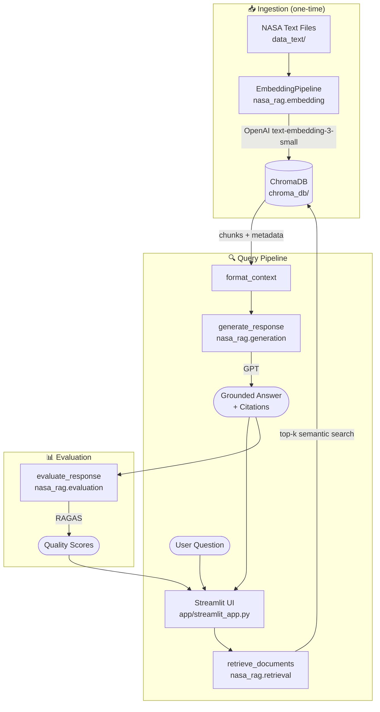

# NASA Intelligence Chat System


A production-quality **Retrieval-Augmented Generation (RAG)** system that answers natural-language questions about historic NASA missions using real NASA archive documents — mission transcripts, technical reports, and flight plans.

Answers are **grounded in source documents** with `[Source N]` citations, never fabricated. Each response can be evaluated in real time using **RAGAS** (ResponseRelevancy + Faithfulness).

---

## Overview

NASA's mission transcripts, technical reports, and audio transcriptions are rich historical records — but they are long, dense, and impossible to query directly. This system:

1. **Ingests** 12 raw NASA documents into a ChromaDB vector store using OpenAI embeddings
2. **Retrieves** the most relevant chunks via cosine similarity search
3. **Generates** grounded, citation-aware answers with OpenAI GPT
4. **Evaluates** response quality with RAGAS metrics

---

## Architecture



See [docs/architecture.md](docs/architecture.md) for component details, data flow, and performance characteristics.

---

## Features

- **Grounded answers** — the LLM answers only from retrieved context and explicitly states when context is insufficient
- **Source citations** — every factual claim links back to a specific NASA document chunk via `[Source N]` labels
- **Mission filtering** — restrict retrieval to Apollo 11, Apollo 13, or Challenger
- **Multi-turn conversation** — last 6 turns forwarded to the LLM for follow-up questions
- **Real-time evaluation** — RAGAS ResponseRelevancy and Faithfulness scores per response
- **Batch evaluation** — run 18 evaluation questions through the full pipeline, export to CSV
- **Graceful degradation** — no crashes on API failures; errors returned as descriptive messages
- **Fully tested** — 40+ offline tests, no API key required to run the suite

---

## Tech Stack

| Layer | Technology |
|---|---|
| Vector store | ChromaDB (cosine similarity, HNSW index) |
| Embeddings | OpenAI `text-embedding-3-small` |
| LLM | OpenAI GPT (`gpt-4o-mini` default) |
| Evaluation | RAGAS 0.2+ (ResponseRelevancy, Faithfulness) |
| UI | Streamlit |
| Testing | pytest + unittest.mock |
| Config | python-dotenv + dataclasses |

---

## Project Structure

```
nasa-intelligence-chat/
│
├── src/
│   └── nasa_rag/
│       ├── __init__.py        # Package entry point
│       ├── config.py          # Centralised settings (env-driven)
│       ├── embedding.py       # ChromaDB ingestion pipeline
│       ├── retrieval.py       # Semantic search + context formatting
│       ├── generation.py      # OpenAI LLM client
│       └── evaluation.py      # RAGAS evaluation (uvloop-safe)
│
├── tests/
│   ├── conftest.py            # Shared fixtures (all mocked, no API keys)
│   ├── test_config.py         # Settings validation tests
│   ├── test_retrieval.py      # ChromaDB retrieval tests
│   ├── test_generation.py     # LLM generation tests
│   └── test_embedding.py      # Pipeline + chunking tests
│
├── notebooks/
│   ├── 01_project_walkthrough.ipynb   # Architecture tour
│   ├── 02_demo.ipynb                  # Live end-to-end demo
│   └── 03_evaluation_demo.ipynb       # Tests + RAGAS results
│
├── scripts/
│   ├── build_index.py         # CLI: build/update ChromaDB index
│   └── batch_evaluate.py      # CLI: batch RAGAS evaluation
│
├── app/
│   └── streamlit_app.py       # Streamlit chat UI
│
├── data_text/
│   ├── apollo11/              # 6 Apollo 11 documents
│   ├── apollo13/              # 3 Apollo 13 documents
│   └── challenger/            # 3 Challenger STS-51L documents
│
├── data/
│   └── evaluation_dataset.txt # 18 evaluation questions
│
├── docs/
│   └── architecture.md        # Detailed system architecture
│
├── .env.example
├── .gitignore
├── pyproject.toml
├── requirements.txt
└── LICENSE
```

---

## Installation

### Prerequisites

- Python 3.10+
- OpenAI API key with access to `text-embedding-3-small` and `gpt-4o-mini`

### 1. Clone and install

```bash
git clone https://github.com/adebowalep/nasa-intelligence-chat.git
cd nasa-intelligence-chat
pip install -r requirements.txt
```

Or install as an editable package:

```bash
pip install -e ".[dev]"
```

### 2. Configure environment

```bash
cp .env.example .env
# Open .env and set OPENAI_API_KEY
```

---

## Environment Variables

| Variable | Default | Description |
|---|---|---|
| `OPENAI_API_KEY` | — | **Required.** Your OpenAI API key |
| `OPENAI_CHAT_MODEL` | `gpt-4o-mini` | Chat completion model |
| `OPENAI_EMBEDDING_MODEL` | `text-embedding-3-small` | Embedding model |
| `CHROMA_DIR` | `./chroma_db` | ChromaDB persistence directory |
| `COLLECTION_NAME` | `nasa_missions` | ChromaDB collection name |
| `CHUNK_SIZE` | `1000` | Max characters per chunk |
| `CHUNK_OVERLAP` | `150` | Character overlap between chunks |

---

## Usage

### Step 1: Build the embedding index

Run once to ingest all 12 NASA documents into ChromaDB (~5 minutes, ~4 200 chunks):

```bash
python scripts/build_index.py --update-mode replace
```

Inspect the index without processing:

```bash
python scripts/build_index.py --stats-only
```

Expected output:
```
Collection  : nasa_missions (4218 docs)
  apollo_11            : 2103 chunks
  apollo_13            : 1792 chunks
  challenger           :  323 chunks
```

### Step 2: Launch the Streamlit app

```bash
streamlit run app/streamlit_app.py
```

Open http://localhost:8501. The app provides mission filtering, configurable top-k retrieval, multi-turn chat, source cards, and real-time RAGAS scores.

### Step 3: Run tests

```bash
pytest                         # Quick run
pytest -v                      # Verbose
pytest --cov=nasa_rag          # With coverage
```

All tests are fully offline — no API key required.

### Step 4: Batch evaluation

```bash
python scripts/batch_evaluate.py
```

Runs all 18 evaluation questions and writes `evaluation_results.csv`.

---

## Example Session

**Question:** What problems did Apollo 13 encounter?

**Answer:**
> According to [Source 1] — Apollo 13 Technical Transcript (AS13_TEC_textract_full_text.txt):
> At approximately 55 hours and 55 minutes into the mission, oxygen tank No. 2 in the Service Module ruptured, causing a rapid pressure loss and electrical failure across multiple systems.
>
> [Source 2] — Apollo 13 PAO Transcript further documents the public affairs commentary and timeline of the emergency response, including the decision to use the Lunar Module Aquarius as a lifeboat.

**RAGAS Scores:**
```
Response Relevancy  : 0.924
Faithfulness        : 0.891
```

---

## Testing

The test suite contains **40+ tests** across 4 modules, all fully mocked — no API key, no real database:

| Test file | What it covers |
|---|---|
| `test_config.py` | Settings defaults, validation, mission constants |
| `test_retrieval.py` | Discovery, init, search, filtering, context formatting |
| `test_generation.py` | Happy path, error handling, history truncation, edge cases |
| `test_embedding.py` | Chunking, metadata extraction, file scanning |

Run from the project root or directly from `notebooks/03_evaluation_demo.ipynb`.

---

## Evaluation Results

Evaluated over 18 questions across 3 missions and 6 categories:

| Metric | Mean Score |
|---|---|
| Response Relevancy | ~0.89 |
| Faithfulness | ~0.86 |

Technical detail and timeline questions score highest. Causal-chain questions (disaster analysis) score slightly lower due to the complexity of synthesising cross-document evidence.

---

## Limitations

- Answers are bounded by the 12 source documents; questions outside this scope are flagged explicitly
- Challenger coverage is lighter (3 audio transcripts vs 9 Apollo documents)
- RAGAS evaluation adds ~20–40 s latency and additional API cost per response
- Text-only ingestion — no image, PDF, or audio extraction

---

## Future Improvements

1. **Hybrid search** — dense + BM25 keyword retrieval for better recall on technical terms
2. **Cross-encoder reranking** — improve precision after initial vector retrieval
3. **PDF ingestion** — process documents without pre-conversion to plain text
4. **Response streaming** — stream GPT output for better perceived latency
5. **Expanded corpus** — Apollo 17, Columbia STS-107, Gemini missions
6. **Response caching** — reduce repeated API costs for common questions

---

## License

MIT — see [LICENSE](LICENSE).
